# cv03-backprop-to-cnn

**A neural network and a convolutional network, written in NumPy, with every
gradient derived by hand, written out in plain maths, and checked against a
numerical derivative before anything is allowed to train on it.**

Package name: `netfs` -- *net from scratch*.

This is the third of four teaching repositories. It exists because the useful
thing about backpropagation is not that it works; it is that you can derive it,
implement it, and then *prove* your implementation is right. Everything here is
built around that last step.

**The hard rule: NumPy does the learning, and nothing else.** Every forward
pass, every backward pass, every loss and every optimiser in `src/netfs/` is
NumPy. PyTorch appears in exactly one file -- `tests/test_torch_oracle.py` --
as an independent second opinion on gradients that have already been computed
by hand, and scipy appears in one other as an independent second opinion on
convolution. Neither ever trains anything. That split is deliberate and is
[ADR-001](docs/DECISIONS.md#adr-001--numpy-does-the-learning-pytorch-and-scipy-only-ever-check-it).

## What a reader will understand by the end

- Why a neuron's gradient is what it is, and how to check it in three lines.
- Why stacking linear layers is algebraically pointless, demonstrated by
  training one until it plateaus at a floor you can derive on paper.
- How to differentiate a two-layer network term by term, what shape every
  intermediate array has, and *why* it has that shape.
- How to write a gradient check, what tolerance to expect, which step size to
  use, and -- the part almost nobody covers -- the one situation where a
  failing gradient check means nothing is wrong.
- Why softmax and cross-entropy are always fused, shown by running the unfused
  version until it returns `nan`.
- How a convolution layer works forwards and backwards, why `im2col` makes it
  fast, and exactly what that speed costs in memory.
- The output-size arithmetic, and the off-by-one that hides a whole column of
  your image from the network without any error message.
- What a small CNN actually learns, including the filter that learned nothing
  and cannot recover.

---

## The flow

```
   ┌──────────────────────────────────────────────────────────────────────┐
   │  01  one neuron          w·x + b, squared error, gradient by hand    │
   │      ↓                   analytic vs numerical: 1.8e-11              │
   │  02  why the bend        two linear layers ARE one linear layer      │
   │      ↓                   XOR floors at 0.25; one ReLU fixes it       │
   │  03  backprop            2 → 2 ReLU → 1, nine gradients, term by term│
   │      ↓                   every intermediate shape, and why           │
   │  04  gradient check      central difference, the h sweep,            │
   │      ↓                   three real bugs introduced on purpose       │
   │  05  softmax + CE        logsumexp(z) − z_y; watch the naive one die │
   │      ↓                                                               │
   │  06  convolution         forward, dW, db, dX — vs scipy, vs torch    │
   │      ↓                                                               │
   │  07  im2col              one gather + one GEMM; 74–389× measured     │
   │      ↓                                                               │
   │  08  pooling & shapes    max routes; floor((n+2p−k)/s)+1             │
   │      ↓                                                               │
   │  09  a CNN, trained      1,898 params, 98.14% on real digits, 10 s   │
   │      ↓                                                               │
   │  10  bridge to detection dense prediction, anchors, NMS  (docs only) │
   └──────────────────────────────────────────────────────────────────────┘

   src/netfs/                        every gradient here appears in
     shapes.py   layers.py           docs/DERIVATIONS.md, and is asserted
     conv.py     pool.py             against a central difference in
     losses.py   gradcheck.py        tests/test_gradients.py
     model.py    optim.py
     train.py    data.py
```

Each stage has a runnable script in `examples/` that prints its numbers and
saves its figure. `docs/WALKTHROUGH.md` walks all ten in order, quoting the code
and the output.

---

## Quickstart

```bash
pip install -r requirements.txt        # numpy is the only one the library needs
python3 -m pytest -q                   # 104 tests, under 10 s
python3 examples/run_all.py            # all 9 examples, ~24 s, regenerates every figure
```

```python
import numpy as np
from netfs import Conv2D, Flatten, Linear, MaxPool2D, ReLU, Sequential
from netfs import Adam, check_model, softmax_cross_entropy, load_image_dataset, train

data = load_image_dataset()                       # 8x8 digits, no download
model = Sequential(
    Conv2D(1, 8, 3, pad=1), ReLU(), MaxPool2D(2),
    Conv2D(8, 16, 3, pad=1), ReLU(), MaxPool2D(2),
    Flatten(), Linear(64, 10, weight_scale=0.01),
)

# Check the gradients BEFORE you train on them. Two forward passes per
# parameter, and it turns "why won't it learn" into a five-second answer.
errs = check_model(model, softmax_cross_entropy, data.x_train[:4] + 1e-2, data.y_train[:4])
print(max(errs.values()))                         # ~1e-9

train(model, softmax_cross_entropy, Adam(model, lr=3e-3),
      data.x_train, data.y_train, data.x_test, data.y_test, epochs=30)
```

---

## Figures

Every figure below is the unedited output of a script in `examples/`,
regenerated by `python3 examples/run_all.py`. All measurements were taken on an
**11th Gen Intel Core i5-1135G7 @ 2.40 GHz**, Python 3.10.12, NumPy 2.2.6,
float64, single machine, CPU only.

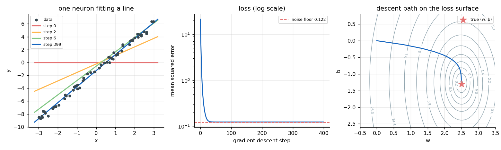

**One neuron, one gradient derived by hand.** A single linear unit fitting 60
noisy points from `y = 2.5x - 1.3`. It recovers `w = 2.4961`, `b = -1.2701`, and
the loss stops at 0.1247 -- not at zero, because the noise variance is 0.1225
and a line cannot beat the noise it was given. The hand-derived gradient agrees
with a central difference to 1.8e-11. From `examples/01_one_neuron.py`.

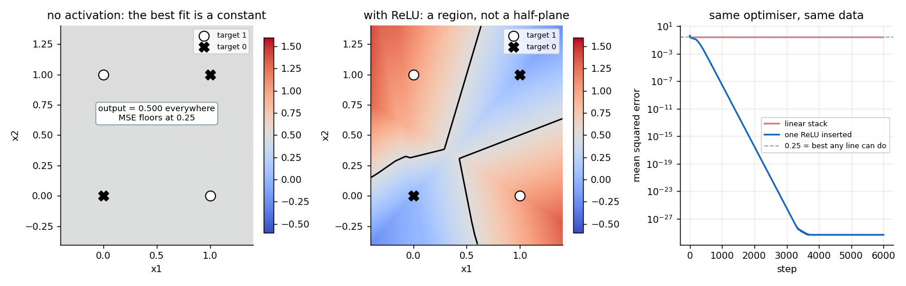

**Two linear layers are one linear layer.** Same data, same optimiser, same
learning rate; the only difference is one ReLU. The linear stack converges
perfectly well -- to the constant 0.5, whose mean squared error is exactly
0.25, a floor derived on paper rather than observed. The ReLU version reaches
1e-28. From `examples/02_why_nonlinearity.py`.

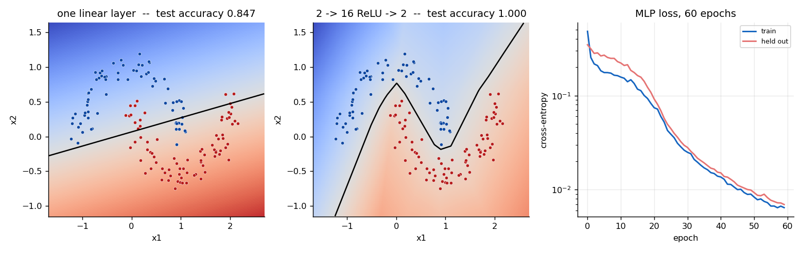

**Backpropagation, then a boundary no line can draw.** The 82-parameter MLP
reaches 1.000 on held-out data where one linear layer reaches 0.847. Note that
the learned boundary is made of straight segments: a ReLU network *is* a
piecewise-linear function. From `examples/03_backprop_mlp.py`.

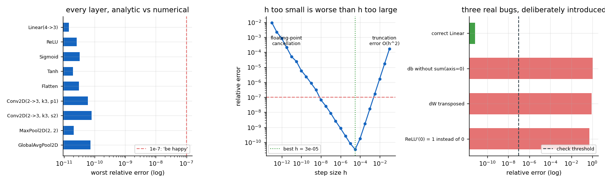

**The most important test in the repository.** Left: every layer, analytic
gradient against central difference, worst error 7.9e-11 against a 1e-7
threshold. Middle: sweeping the step size `h` across nine orders of magnitude --
truncation error on the right branch, floating-point cancellation on the left,
minimum at `h = 3.2e-5`. Right: three backward passes broken on purpose (a bias
gradient missing its batch sum, a transposed `dW`, a ReLU whose derivative is 1
at zero) all caught at relative error near 1. From
`examples/04_gradient_check.py`.

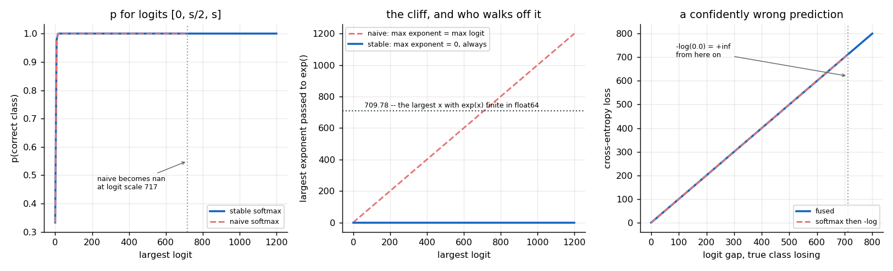

**Why softmax and cross-entropy are fused.** The naive route returns `nan` past
a logit of about 717 (`exp(709.79)` is the last finite exponential in float64),
and returns `+inf` for a confidently wrong prediction, because `-log(0.0)` is
`+inf`. The fused form `logsumexp(z) - z_y` never exponentiates a positive
number and never forms a probability: it returns a loss of 900 with a gradient
still bounded in [-1, 1]. From `examples/05_softmax_stability.py`.

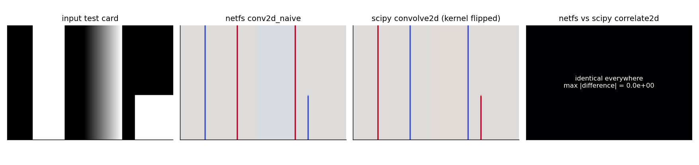

**Convolution, against two independent references.** Our hand-written layer
matches `scipy.signal.correlate2d` to exactly 0.0 across the whole test card.
The third panel is `scipy.signal.convolve2d`, which flips the kernel: every sign
is reversed. That is the proof, in a picture, that what every framework calls
convolution is cross-correlation. From `examples/06_convolution.py`.

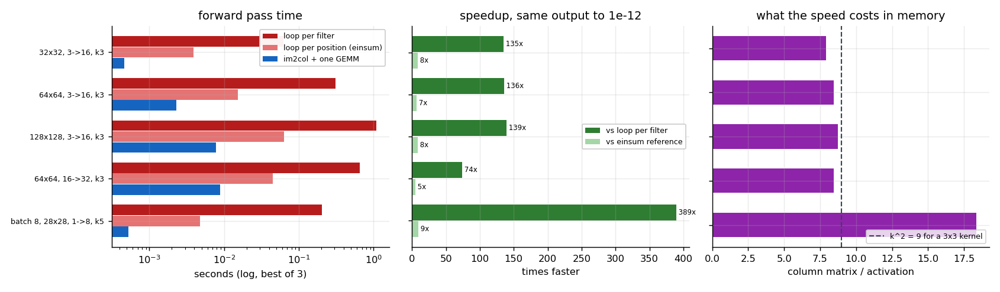

**im2col: 74x to 389x, and what it costs.** Three implementations timed, so
that "faster than what" has an answer: im2col is 74-389x faster than a Python
loop per filter and 5-9x faster than the einsum-vectorised reference the library
ships, with outputs asserted equal to 1e-12 before anything is timed. The price
is memory: the column matrix is about `k²` times the activation -- 12.8 MB
becomes 116 MB for a 224x224x64 map with a 3x3 kernel. From
`examples/07_im2col_speedup.py`.

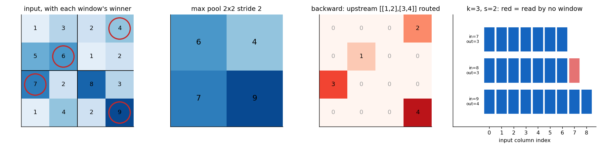

**Max routes, and the off-by-one.** The backward pass of max pooling sends the
entire upstream gradient to the winning position and exactly zero to the other
twelve. The right-hand panel is the arithmetic bug everyone hits: at `k=3,
stride=2`, inputs of width 7 and 8 both produce an output of width 3, and on the
input of 8 the last column is read by no window at all. No warning, no error.
From `examples/08_pooling_shapes.py`.

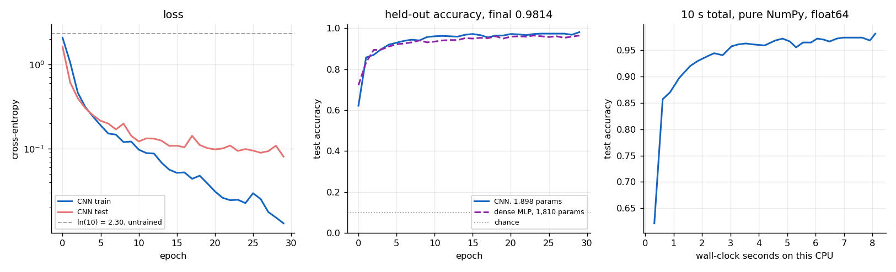

**1,898 parameters, 98.14%, 9.8 seconds.** Two conv layers, two pools and a
linear head, trained for 30 epochs on 1,258 8x8 handwritten digits in pure
NumPy float64. The dashed line is a dense network with a nearly identical
parameter count (1,810) on the same data, reaching 0.9647 -- the convolution is
worth about 1.7 points here, which is a modest but real margin and exactly what
you should expect on 8x8 images. From `examples/09_train_cnn.py`.

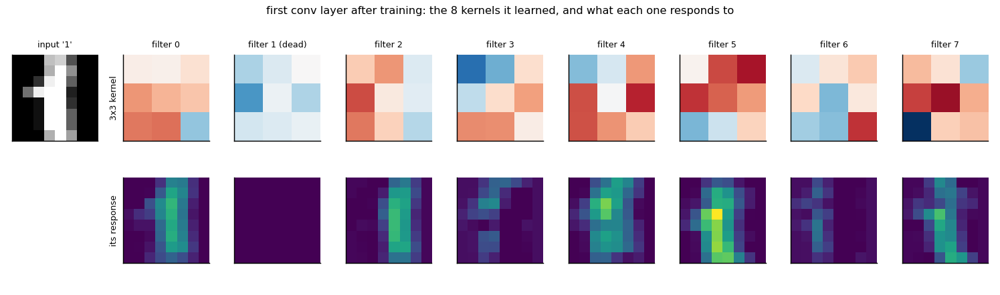

**What it learned, and one thing it did not.** One of the eight first-layer
filters never fires on any test image. Its pre-activation is negative
everywhere, so it outputs zero, so it receives exactly zero gradient, so no
optimiser can revive it. That is the dying-ReLU problem measured in a network
that was actually trained -- and the model reached 98.14% carrying it. From
`examples/09_train_cnn.py`.

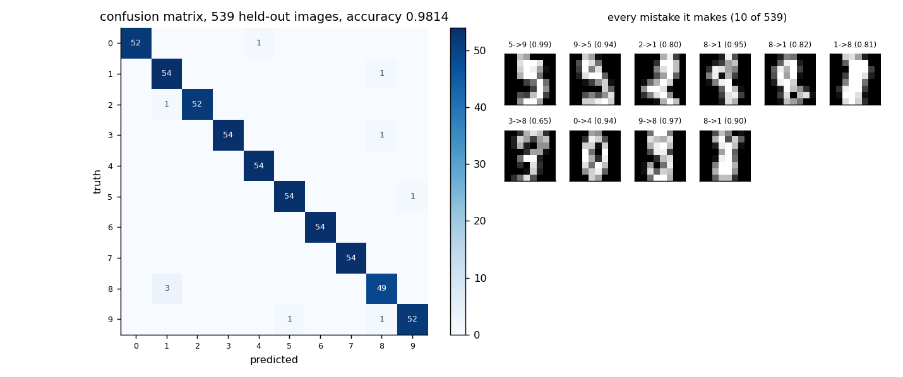

**The mistakes are the mistakes a person would make.** Rows are truth, columns
are the guess. The largest off-diagonal entry is three 8s called 1, and the
images are 8s drawn with a narrow waist. Ten errors in 539 held-out images.
From `examples/09_train_cnn.py`.

---

## Results

Measured on an 11th Gen Intel Core i5-1135G7 @ 2.40 GHz, CPU only, float64,
Python 3.10.12 / NumPy 2.2.6 / PyTorch 2.13.0+cpu / SciPy 1.15.3 /
scikit-learn 1.7.2.

| | |
|---|---|
| **Dataset** | `sklearn.datasets.load_digits` -- the UCI optical-digits set, 1797 real handwritten digits, 8x8, 10 classes. Bundled inside the scikit-learn wheel, so nothing downloads. |
| **Split** | Stratified random, seed 0: 1,258 train / 539 test |
| **Model** | Conv(1→8,3x3,pad1) → ReLU → MaxPool2 → Conv(8→16,3x3,pad1) → ReLU → MaxPool2 → Flatten → Linear(64→10). **1,898 parameters** |
| **Optimiser** | Adam, lr 3e-3, batch 32, 30 epochs |
| **Loss at init** | 2.3139, against a predicted `ln(10) = 2.3026` |
| **Training time** | **9.8 s** total, 0.27 s/epoch |
| **Train accuracy** | 0.9992 |
| **Test accuracy** | **0.9814** (529/539), test loss 0.0803 |
| **Dense baseline** | 0.9647 with 1,810 parameters, same data, same schedule |
| **Dead filters** | 1 of 8 in the first conv layer, never fires on any test image |

**Gradient checks, achieved.** Analytic against central difference (`h = 1e-5`,
float64), relative to the gradient array's scale:

| layer | dW | db | dinput |
|---|---|---|---|
| `Linear(4→3)` | 1.22e-11 | 1.42e-11 | 8.90e-12 |
| `ReLU` | -- | -- | 2.57e-11 |
| `Sigmoid` | -- | -- | 3.23e-11 |
| `Tanh` | -- | -- | 1.94e-11 |
| `Flatten` | -- | -- | 3.05e-11 |
| `Conv2D(2→3, k3, pad 1)` | 1.61e-11 | 2.65e-11 | 5.96e-11 |
| `Conv2D(2→3, k3, stride 2)` | 1.48e-11 | 1.93e-11 | 7.87e-11 |
| `MaxPool2D(2,2)` | -- | -- | 2.04e-11 |
| `GlobalAvgPool2D` | -- | -- | 7.23e-11 |

**Worst relative error anywhere: 7.9e-11.** The tests assert 1e-7, which is
deliberate headroom for a different BLAS or a different summation order on
another CPU. Against PyTorch autograd (float64) the same layers agree to better
than 1e-10, asserted in `tests/test_torch_oracle.py`.

**im2col speedup**, best of 3, outputs asserted identical to 1e-12 first:

| configuration | loop per filter | loop per position (einsum) | im2col + GEMM | vs full | vs einsum |
|---|---|---|---|---|---|
| 32x32, 3→16, k3 | 0.0626 s | 0.0039 s | 0.00046 s | 135x | 8x |
| 64x64, 3→16, k3 | 0.3114 s | 0.0152 s | 0.00229 s | 136x | 7x |
| 128x128, 3→16, k3 | 1.0927 s | 0.0636 s | 0.00785 s | 139x | 8x |
| 64x64, 16→32, k3 | 0.6528 s | 0.0445 s | 0.00887 s | 74x | 5x |
| batch 8, 28x28, 1→8, k5 | 0.2041 s | 0.0048 s | 0.00052 s | 389x | 9x |

Both columns are reported because quoting only the first would be true and
misleading: most of the win is ordinary vectorisation, and the GEMM is worth a
further single-digit factor at these sizes. Every loss and accuracy in this
README is bit-identical between runs (fixed seeds, deterministic code); the
*timings* move by roughly 20-30% depending on what else the machine is doing,
which is why the run count and the hardware are stated and why you should
re-run `examples/07_im2col_speedup.py` and use your own.

---

## Why it is built this way

Full records with alternatives and costs are in
[docs/DECISIONS.md](docs/DECISIONS.md). The five that matter most:

**NumPy learns; PyTorch and scipy only check** ([ADR-001](docs/DECISIONS.md)).
Two independent lines of defence, clearly labelled. A finite-difference check
differentiates *our own forward pass*, so if the forward pass is wrong in an
interesting way the check passes anyway -- only an independent implementation
catches that. Cost: the CNN trains in 10 s instead of under a second, and this
approach is useless for anything real. Said plainly rather than implied
otherwise.

**float64 everywhere** ([ADR-003](docs/DECISIONS.md)). Gradient checking does
not work in float32: the central difference subtracts two nearly equal numbers
and a 24-bit mantissa leaves relative errors around 1e-3 on flawless code, which
is above every threshold anyone sets. Cost: 2x memory and a similar factor of
time -- irrelevant here, decisive at any real scale, which is why real training
is mixed-precision and real gradient checks are not.

**NCHW, matching PyTorch exactly** ([ADR-002](docs/DECISIONS.md)). The oracle
comparison becomes literal, with no transposes on either side. A transpose
inside a test is a place for the test to be wrong in the same way the code is,
and the one thing an oracle must not share with the code under test is a bug.
Cost: images from OpenCV or matplotlib need a transpose at the boundary, which
is confined to `netfs.data` and the plotting code.

**im2col is the implementation; the naive loop is kept and tested against it**
([ADR-005](docs/DECISIONS.md)). The loops are the definition and im2col is index
bookkeeping; keeping both, and asserting they agree exactly, is what makes the
fast one believable. An im2col indexing bug produces no exception and no shape
error -- just a permuted kernel -- so a test is the only thing that catches it.

**No autograd tape** ([ADR-010](docs/DECISIONS.md)). A tiny `Tensor` class
recording operations is a well-known and enjoyable exercise, and it would hide
exactly what this repository exists to show: once `loss.backward()` works, the
reader is back to trusting a mechanism instead of reading one. Cost: only
straight chains are supported. A ResNet skip connection would need a real graph,
and the one extra rule it requires -- a value consumed twice receives the sum of
both gradients -- is stated in the derivations but not implemented.

---

## What the tests actually assert

`python3 -m pytest -q` runs **104 tests in under 10 seconds**, offline and
deterministic. (On a machine with a broken global pytest plugin -- ROS, usually
-- prefix with `env -u PYTHONPATH PYTEST_DISABLE_PLUGIN_AUTOLOAD=1`.)

| file | tests | what it pins down |
|---|---|---|
| `test_gradients.py` | 25 | Analytic vs central-difference gradients for **every** layer, both parameters and input, at several strides and paddings; the whole MLP and the whole CNN against their real losses; that matching zeros count as agreement; that `h = 1e-10` is *worse* than `h = 1e-5`; and that the ReLU kink at exactly zero disagrees for a reason. |
| `test_conv.py` | 15 | Conv output against a hand-computed 2x2; against `scipy.signal.correlate2d`; that `convolve2d` flips every sign; that im2col equals the naive loops **exactly** at six stride/padding combinations; the im2col index trace; that multi-channel conv is a sum of per-channel correlations, not a slide in depth. |
| `test_shapes.py` | 14 | `floor((n+2p-k)/s)+1` against seven cases computed on paper, including the one where inputs of 7 and 8 give the same output; that 'same' padding does not exist for even kernels; the 1,792-vs-150,528,000 parameter comparison; ResNet-18's stem at 118,013,952 MACs; receptive-field stacking. |
| `test_losses.py` | 12 | The hand-worked softmax; that the gradient rows sum to exactly zero; that fused and unfused agree to 1e-12 on safe inputs and that the naive one returns `nan`/`inf` where the fused one is correct; that `reduction` changes the gradient by a factor of N. |
| `test_layers.py` | 11 | That two linear layers equal one constructed linear layer to 1e-12; the hand-set XOR weights; that a dead ReLU gets exactly zero; that the bias gradient is a sum over the batch; sigmoid's 0.25 and tanh's 1.0; that He initialisation keeps the activation scale alive through ten layers and Xavier does not. |
| `test_train.py` | 10 | That XOR floors at 0.25 without a nonlinearity and reaches 1e-3 with one, and that extra linear capacity does not move that floor; all five learning-rate regimes on a quadratic, including the orbit whose printed loss never changes; that the CNN can overfit twelve images to 100%; that the optimiser updates parameters in place. |
| `test_pool.py` | 9 | Max pooling forward and the exact backward routing matrix; that overlapping windows accumulate; that a 5x5 input with a 2x2 stride-2 window silently drops a row and a column; that ties send everything to the first winner. |
| `test_torch_oracle.py` | 8 | `Linear`, `Conv2D` at three stride/padding settings, `MaxPool2D`, the fused loss and the entire CNN, each against PyTorch autograd in float64, to better than 1e-10. Skips itself if torch is absent. |

---

## Honest limitations

- **This is a teaching implementation, not a framework.** It is orders of
  magnitude slower than PyTorch and always will be. Use it to understand what a
  framework does, then use the framework.
- **Straight chains only.** There is no graph, so no skip connections, no
  branching, no multiple inputs. The rule that a branching graph needs -- a
  value consumed twice receives the sum of both gradients -- is derived in the
  docs but not implemented ([ADR-010](docs/DECISIONS.md)).
- **No BatchNorm, no dropout, no learning-rate schedule, no augmentation, no
  weight decay.** Each of those is a real part of training a real model and none
  of them is needed to explain backpropagation.
- **The 98.14% is on a stratified-random split, not a writer-disjoint one.** The
  digits dataset does not expose which of its 43 writers produced each sample,
  so samples from one writer land on both sides of the split. The number is
  therefore an **optimistic** estimate of accuracy on a new writer's
  handwriting. The script prints this caveat and `netfs.data` carries it on the
  dataset object ([ADR-009](docs/DECISIONS.md)).
- **8x8 images are small enough to flatter a dense baseline.** The convolution's
  1.7-point margin here is real but modest; the spatial prior pays off far more
  at 224x224. Reporting the small number honestly is more useful than implying
  the large one.
- **The gradient-check summary can hide an error confined to very small
  entries**, because it is measured against the array's scale rather than per
  entry. That trade-off, and the three other defences that cover it, are in
  [ADR-008](docs/DECISIONS.md).
- **No GPU, no distributed training, no mixed precision**, and float64
  throughout, which is the opposite of what production does and the right choice
  for a gradient check.
- **The im2col timings are one machine's numbers.** They are labelled with the
  CPU, the interpreter, the library versions and the run count; re-run
  `examples/07_im2col_speedup.py` and use yours.

---

## Documentation

- **[docs/WALKTHROUGH.md](docs/WALKTHROUGH.md)** -- the long version. Ten
  stages, each quoting the code that does the work and the output it produces,
  ending with the bridge from classifier to detector.
- **[docs/DERIVATIONS.md](docs/DERIVATIONS.md)** -- every gradient used in the
  code, derived in plain text. The dense layer, the activations, softmax
  cross-entropy (including the cancellation that is the whole argument for
  fusing them), convolution's `dW`, `db` and `dX`, both pooling layers, the
  centred difference, the output-size formula, and the optimisers.
- **[docs/DECISIONS.md](docs/DECISIONS.md)** -- twelve architectural decision
  records, each with the alternatives and what this choice costs.

---

## Related repositories

- **Project 1 of this teaching series -- images as numbers, and classical
  filtering.** Pixels, dtypes, the silent `uint8` wrap, views versus copies,
  convolution as a hand-written kernel, blur and gradient and edge. This
  repository assumes you already know that an image is an array and that a
  kernel slides over it; project 1 is where that is established.
- **Project 2 of this teaching series -- features, matching and robust
  geometry.** Corners, descriptors, matching, and fitting a homography with
  RANSAC and a DLT. It is the last stop before the pivot this repository makes:
  everything in project 2 is a plan a human wrote down, and everything here is
  learned from data instead.
- **[object-detection-benchmark](https://github.com/Pratyush150/object-detection-benchmark)**
  -- the measured side of the story this repository ends by describing. Where
  stage 10 explains how a classifier becomes a detector without implementing
  one, that repository fine-tunes a real detector and reports mAP, AP_small and
  latency on named hardware.

---

## License

MIT. See [LICENSE](LICENSE).
